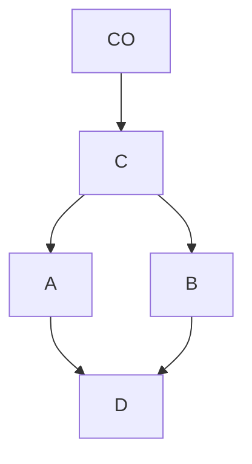
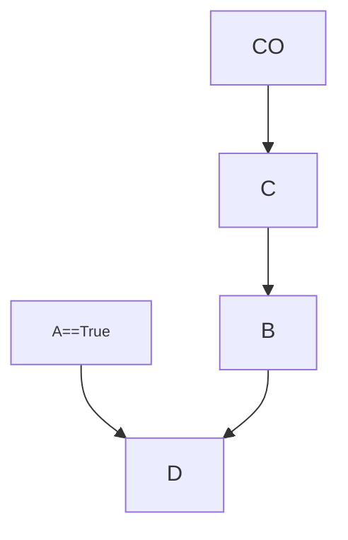

# The Ladder of Causation

- First encountered the ladder in reading [[Genesis]] for "the hundredth time"[^2].
- God asked [[Adam and Eve]] _what_ they had done, they both answered with _why_. 
	- G: "Have you eaten from the tree which I forbade you?" 
	- Adam: "The woman you gave me for a companion, she gave me fruit from the tree and I ate". 
	- G: "What is this you have done?" 
	- Eve: "The serpent deceived me, and I ate".
- He asked for the facts, and they gave him explanations.
- More importantly, **both somehow were convinced that naming causes would paint their actions in a different light**.
- He believes these nuances carry three "profound implications": 
1. Early in our evolution, we realized that the world consists not only of dry facts, but rather an intricate web of cause-effect relationships. 
2. Causal explanations make up the bulk of our knowledge, and should be the cornerstone of machine intelligence. Untitled
3. Our transition from "processors of data" to "makers of explanations" wasn't gradual, it required an external push (the forbidden fruit of Eden). He extrapolates that **no machine can derive explanations raw data without an external push**.
- Somehow we as a species developed a "causal imagination" that allows us to imagine nonexistent things. He, along with [[Yuval Harari]], think that this was the key to everything.
- Returning to the story of [[Genesis]], it is impossible to claim that Eve caused you to eat the fruit if you are unable to posit a counterfactual. It necessitates the ability to imagine a world in which she did not hand you the fruit.
- This is essentially the establishment of a mental model as the arena within which imagination takes place. 
	- He gives a hunting example: humans are able to consider the effect of different factors on the success of a hunt. More hunters, better weather, size of the animal, differing terrain, etc. This is a layer of abstraction on top of raw experience that is unique to humans, it seems.

## The Three Levels of Causation

### Seeing / [[Association]]

- Involves detection of regularities in our environment.
- Many animals share in this level.
- We say that one event is associated with another if observing one changes the likelihood of observing the other.
- **Activity**: Seeing, observing
- **Questions**: 
	- What if I see...? 
	- How are the variables related? 
	- How would seeing X change my belief in Y?
- **Examples**: 
	- What does a symptom tell me about a disease? 
	- What does a survey tell us about the election results?

### Doing / [[Intervention]]

- "Involves predicting the effect(s) of deliberate alterations of the environment and choosing among these alterations to produce a desired outcome." [^2]
- Few other animals share in this level.
- Use of tools, as long as it is intentional use, can be taken as a sign of reaching this level.
- **Activity**: Doing, intervening
- **Questions**: - What if I do...? - How? - What would Y be if I do X? - How can I make Y happen?
- **Examples**: - If I take aspirin, will my headache be cured? - What if we ban cigarettes?

### Imagining / [[counterfactual]]s

- Possessing a theory of the tool telling us why it works and what to do when it doesn't.
- This level, he argues, is what prepared us for revolutions in agriculture and science and led to the drastic change in our species' impact on the planet.
- **Activity**: 
	- Imagining 
	- Retrospection 
	- Understanding
- **Questions**: 
	- What if I had done...? 
	- Why? 
	- Was it X that caused Y? 
	- What if X had not occurred? 
	- What if I had acted differently?
- **Examples**: 
	- Was it the aspirin that stopped my headache? 
	- Would Kennedy be alive is Oswald had not killed him? 
	- What if I had not smoked for the previous 2 years?

- Modern machine learning programs operate almost entirely on the first level, as they did thirty years ago.
-  "They are driven by a stream of observations to which they attempt to fit a function" [^3] Raw data drives this fitting process. 
- "If, for example, the programmers of a driverless car want it to react differently to new situations, they have to add those new reactions explicitly. The machine will not figure out for itself that a pedestrian with a bottle of whiskey in hand is likely to respond differently to a honking horn. This lack of flexibility and adaptability is inevitable in any system that works at the first level of the Ladder of Causation." [^4]

- The second level is characterized by [[intervention]]. '"What will happen to floss sales if we double the price of toothpaste?"' 
	- This involves not only seeing, but changing what is. 
	- Questions about intervention cannot be answered with passively collected data, no matter how much of it we have. 
	- "A direct way to predict the result of an intervention is to experiment with it under carefully controlled conditions." [^5] 
		- e.g. Facebook performing UI experiments with small subsets of their customer base. They can hold all other variables equal except for the UI changes and observe the difference in behavior. 
	- If we have a sufficiently strong and accurate **[[causal model]]**, we can use observational data (rung-one) to answer interventional (rung-two) questions. 
	- The causal model is required for machine learning to answer questions about interventions, because the causal model breaks the rules of the environment the machine was trained in. It won't be able to break out to a level of intervention-type thinking without a causal model to bring it up another level.

- The third level consists of [[counterfactual]]s. Why questions. 
	- To answer these questions we must in effect go back in time, change history, and ask "What would have happened if I had not done X?" 
	- "This ability most distinguishes human from animal intelligence, as well as from model-blind versions of AI and machine learning." [^6] 
	- Science is already in the habit of making useful claims about would-haves, things that have not happened. 
	- **The laws of physics can be interpreted as counterfactual assertions:** 
		- Had the weight on a spring doubled, the length of the spring would have doubled as well. 
		- Assertions such as this one are backed by a huge amount of experimental (rung-two) knowledge, derived from observing a large number of springs in many laboratories over many many different occasions. 
		- Once we have "derived a law" in physics, all possible different worlds with any weight $x$ and any length $L_{x}$ are treated as objectively knowable and simultaneously active, even though only one scenario exists at any given point in time. 
	- [[Yuval Harari]] believes the depiction of imaginary creatures is a manifestation of a new ability in man. He calls this the **[[Cognitive Revolution]]**, and traces the nascence of this ability to the [Lion Man sculpture](https://en.wikipedia.org/wiki/Lion-man) found in Stedel Cave in SW Germany from roughly 40,000 years ago. 
		- He points to this as **the earliest example of a creature that is pure imagination.** 
		- The argument is that this sculpture is a precursor of every philosophical theory, scientific discovery, and technological innovation. "Every one of these had to take shape in someone's imagination before it was realized in the physical world." [^7]

## The Mini-Turing Test

- Turing's "imitation game" (put forward in 1950) posits that a computer could be called a "thinking machine" if an ordinary human communicating via text could not tell whether they were communicating with a human or a computer. 
	- Turing also proposed a strategy for passing the imitation game: "Instead of trying to produce a program to simulate the adult mind, why not rather try to produce one which simulates the child's? Presumably the child brain is something like a notebook as one buys it from the stationer's. Rather little mechanism, and lots of blank sheets." [^8]
- The [Loebner Prize](https://en.wikipedia.org/wiki/Loebner_Prize) competition offers \$100,000 to any program that can fool all four of its judges. Over the last 25 years, no program has even fooled half of the judges.
- **The key component of this "childlike intelligence" is a mastery of causation**.
- Pearl's "mini-Turing" test asks the question: "How can machines (and people) represent causal knowledge in a way that would enable them to access the necessary information swiftly, answer questions correctly, and do it with ease, as a three-year-old child can?" [^9] 
	- The process is to first take a simple story, encode it on a machine somehow, and then test to see if the machine is able to answer causal questions that a human could answer. 
	- "mini" for two reasons 
		1. Confined to causal reasoning, excluding other realms of human knowledge such as vision and natural language. 
		2. The story can be encoded in any "convenient representation." The machine is not burdened with acquiring the story from personal experience. 
			- The representation is really important, and needs to come first, because without representation we wouldn't know how to store information for future use. 
			- Paradigm in AI and the study of cognition: "Representation first, acquisition second." 
			- [[causal diagram]]s not only can communicate knowledge easily, but these models pass the mini-Turing test.

### Firing Squad Example

- Scenario is that a prisoner is about to be executed by firing squad. A certain chain of events _must_ occur for this to happen.

1. Court orders the execution (CO)
2. Order goes to a captain (C)
3. Captain signals the soldiers (A, B) to fire
4. Assume that (A, B) never miss, they only fire on command, and if either one shoots the prisoner dies (D)

#### [[Association]] Diagram



- Each of the unknowns (CO, C, A, B, D) is a boolean value: D === true means the prisoner is dead; D === false means the prisoner is alive
- Using this graph we can start answering causal questions: 
	- **[[Association]]**: If the prisoner is dead, does that mean the court order was given? 
	- We can trace up the graph and, using standard logic, conclude that the soldiers wouldn't have fired without their captain's command, which had to come from a court order

#### [[Intervention]] Diagram



- **[[Intervention]]**: What if A decides to fire on his own initiative? Will the prisoner be dead or alive? 
	- If just using rules of logic, this question is meaningless because it goes against the "rules" defined in the original arrangement. **Computers are not good at breaking rules**. 
	- We need to "teach" the computer the difference between **observing** an event and **making an event happen** 
	- To the computer: "Whenever you make an event happen, remove all arrows that point to that event and continue the analysis by ordinary logic, as if the arrows had never been there." 
	- "Making an event happen means that you remove it from all other influences and subject it to one influence&mdash;that which enforces its happening."" [^10] 
	- Nothing about the intervened value should affect other variables in the model
- **If we _see_ A shoot, we conclude that B shot too. If A _decides_ to shoot, or if we _make_ A shoot, then we can't conclude anything about B's behavior just from that information.**

#### [[Counterfactual]] Diagram

```mermaid
graph TD;
classDef FixFont font-size:11px;
CO[CO==True]:::FixFont --> C;
C[C==True]:::FixFont --> B;
A[A==False]:::FixFont --> D=?:::FixFont;
B[B==True]:::FixFont --> D=?:::FixFont;
```

- From observing that the prisoner is dead, we ask **what would have happened if soldier A had decided not to fire?**
- To pass the mini-Turing test, the computer must conclude that the prisoner would be dead in this fictitious world as well, because B would still have shot.
- We have to teach the computer how to selectively break the rules of logic

- **A [[causal model]] entails more than merely drawing arrows. Behind the arrows, there are probabilities. When we draw an arrow from X to Y, we are implicitly saying that some probability rule or function specifies how Y would change if X were to change. We might know what the rule is; more likely, we will have to estimate it from data.**[^12]

- One of the more interesting features of [[causal diagram]]s is the fact that we can leave mathematical details unspecified. The structure of the diagram enables us to estimate causal and counterfactual relationships.
- Even when the probabilities involved in the [[causal diagram]] change, the structure of the diagram will remain invariant, which is "the key secret to causal modeling."[^13]

## On Probabilities and Causation

- The way that causality was formally articulated historically was through conditional probabilities. "If we see X, then the probability of Y increases." But the increase might happen for "other reasons." Because of this, the pursuit inevitably ends up trying to eliminate these "other reasons."

- Judea Pearl isn't attempting to **define** causation in this book, rather he's trying to explain how to answer causal queries and what information is needed to answer them. 
	- He draws a parallel with [[Euclid]]'s axioms: we don't need a definition of a point or a line to answer all queries about them on the basis of [Euclid's postulates](https://en.wikipedia.org/wiki/Euclidean_geometry#Axioms) (axioms) 
		- What's odd to me about this assertion is the fact that [[Euclid]] does put forward definitions of points and lines right at the beginning of the _Elements_. Perhaps the distinction is that this is only a linguistic definition, the definition of a point as "that which has no part" in [[Euclidean geometry]] is never actually _used_ anywhere, merely put forward as a term to orient the reader.
- This notion of a "common-cause," also called a **[[confounder]]**, has historically been difficult for philosophers. 
	- If we take probability-raising criteria "at face value", then high ice-cream sales cause crime 
		- This is because the probability of crime is higher in months when more ice cream is sold. 
		- We can explain this by saying that both are more probable in summer, when the weather is warmer. 
		- Still, how can we put forward philosophical criterion which could tell us that the weather, and not the sale of ice cream, is **causing** the increase in crime?
- "Once you misrepresent 'probability raising' in the language of conditional probabilities, no amount of probabilistic patching will get you to the next rung of the ladder. As strange as it may sound, the notion of probability raising cannot be expressed in terms of probabilities" [^14]
- We "rescue" the probability raising idea by implementing the "do" operator - We can say that X causes Y if the probability of Y when we do X is greater than the probability of Y when we don't do X - `P(Y | do(X)) > P(Y)` 
	- This is an [[intervention]] (rung two) expression 
	- "If we have a causal diagram and data on hand and a researcher asks the above, we can answer his question coherently and algorithmically and thus decide if X is a cause of Y in the probability-raising sense." [^15]
- Pearl introduced the idea of [[Bayesian network]]s in the mid-80's, which focuses on incorporating probabilities into an idealized, decentralized brain for decision-making. 
	- "Given that we see certain facts, [[Bayesian network]]s can swiftly compute the likelihood that certain other facts are true or false." [^16] 
		- This explanation immediately seems like rung-one reasoning, because it doesn't allow for [[intervention]] (changing the graph)

- **"The main point is this: while probabilities encode our beliefs about a static world, causality tells us whether and how probabilities change when the world changes, be it by intervention or by act of imagination."**[^17]

[[02-from-buccaneers-to-guinea-pigs--the-genesis-of-causal-inference]]

[^1]: p.24
[^2]: p.27
[^3]: p.30
[^4]: p.31
[^5]: p.32
[^6]: p.33
[^7]: p.35
[^8]: p.37
[^9]: p.37
[^10]: p.41
[^11]: p.41
[^12]: p.45
[^13]: p.46
[^14]: p.49
[^15]: p. 49
[^16]: p.50
[^17]: p. 51

[//begin]: # "Autogenerated link references for markdown compatibility"
[02 - From Buccaneers to Guinea Pigs - The Genesis of Causal Inference]: 02 - From Buccaneers to Guinea Pigs - The Genesis of Causal Inference "Ch. 2"
[//end]: # "Autogenerated link references"